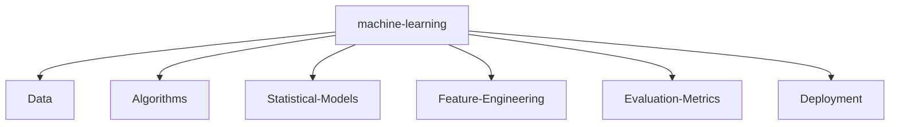

#  Hello, my name is Dmitry (Di).

**Project Status:**  

**Technology:**  

**Metrics:**  

I am 🧙 Lead Full-Stack Software Engineer and 🏆 Open Source lover

Welcome to my page; on my Github, you can find:

- Projects created by me
- Projects contributed by me

## 📑 Table of Contents

- [📬 Contact & Social](#-contact--social)
- [📊 Github Stats](#github-stats)
- [🔖 Featured Repositories](#-featured-repositories)
- [💼 Personal Stats](#personal-stats)
- [💻 Technology Stack](#-primary-technology-stack)
- [📊 GitHub Activity Graph](#-github-activity-graph)
- [🚀 Quick Setup](#-quick-setup)
- [📄 License](#mit)

---

## 📬 Contact & Social

<em>I am open to new opportunities and collaborations.</em>

## Github stats:

 
 

## 🔖 Featured repositories:

---

## Personal Stats

### Professional Summary

With over 15 years of experience and 7+ years of education in Computer Science, a Lead Full-Stack Software Engineer specializes in designing and developing web applications. Skilled in JavaScript frameworks like React, Vue, Svelte, Stencil, and Angular, and proficient with back-end technologies such as Node, Go, and Rust, this role focuses on creating scalable, efficient, and secure applications.

  
Highlights / Proficiencies / Interests / Believes

Highlights:

- ⭐ 15+ years of professional experience in full lifecycle development (web2/web3)
- ⭐ 7+ years of leadership positions (Technical Lead, Technical Architect, CTO/CEO)
- ⭐ Delivered over 50+ projects
- ⭐ Worked with over 25+ companies from startup to enterprise level
- ⭐ Mentoring over 150+ individuals on how to grow their technical and leadership skills
- ⭐ Co-founder and co-creator of 5 Web2 and 3 Web3 projects
- ⭐ Web2 and Web3 expert, I specialize in facilitating the seamless transition from Web2 to Web3 technologies.
- ⭐ Worked on innovative and cutting-edge projects
- ⭐ Contribute to industry thought leadership
- ⭐ Contribute to open source and private source
- ⭐ Master new technologies, computer science, and mathematics

Proficiencies:

- 📚 JavaScript, TypeScript, Node.js with Serverless and Containers and Microservices architecture
- 📚 React.js + Next.js + SSR/CSR + Prisma + Vercel
- 📚 Vue.js + Nuxt.js + SSR/CSR + TypeOrm + Cloudflare
- 📚 Angular, RxJS, NgRx
- 📚 Svelte and Stencil + Storybook + Web Components
- 📚 SQL and NoSQL databases (MySQL, PostgreSQL, MongoDB, DynamoDB, Redis)
- 📚 AWS, Azure and GCP
- 📚 Go lang, Move lang, Rust
- 📚 HTML5/CSS3 + Canvas + WebGL + Animation
- 📚 Agile, Scrum, Kanban
- 📚 Web2/Web3 startups
- 📚 Cryptography (cryptocurrency and blockchain)
- 📚 Team Leadership
- 📚 Project Leadership

Interests:

- ✔️ Self-education and self-development: Continuously seek opportunities for personal growth, self-improvement, and acquiring new knowledge and skills to stay at the forefront of industry trends and advancements.
- ✔️ Family: Place great importance on nurturing and cherishing family bonds, fostering strong relationships, and maintaining a healthy work-life balance to support personal well-being and fulfillment.
- ✔️ Sport (gym, padel tennis, crossfit): Engage in physical activities such as gym workouts, padel tennis, and crossfit, recognizing the importance of maintaining an active and healthy lifestyle to enhance productivity, focus, and overall well-being.

Big believer in:

- 💡 Power of continuous learning and personal growth
- 💡 Importance of cultivating a positive mindset and embracing optimism
- 💡 Value of hard work and perseverance in achieving success
- 💡 Power of empathy and kindness in fostering meaningful connections and creating a harmonious society
- 💡 Importance of ethical behavior and integrity in all aspects of life

<!--   GitHub stats graph -->

### 📈 GitHub Activity Graph:

<!--   green snake -->

<!--   stats + languages -->

| .                                                                                                                                                 | .                                                                                                                                  |
| ------------------------------------------------------------------------------------------------------------------------------------------------- | ---------------------------------------------------------------------------------------------------------------------------------- |
|  |  |

<!--   profile-green-animate -->

<!--   grid-snake  -->

<h4 align="center">🏆 Trophy: Github Profile Trophy</h4>

 

## 🤖 Machine Learning Expertise

Experienced in the full machine learning lifecycle, from data collection to production deployment:

[MIT](LICENSE)

---

## 💬 Let's Connect

If you liked my profile, you can **Star ⭐** the repo and if you want to use this template you can **Fork** it!

**Interested in collaboration?** I'm open to:

- Contributing to open source projects
- Technical discussions and consulting
- Speaking engagements
- Mentorship opportunities

Feel free to submit PRs, issues, or email me. For meetings, please describe the agenda in advance.

## 📊 Advanced Repository Analytics (OSS Insight)

| Star Geographic Distribution                                                                                                                                                       | Star History                                                                                                                                                  |
| ---------------------------------------------------------------------------------------------------------------------------------------------------------------------------------- | ------------------------------------------------------------------------------------------------------------------------------------------------------------- |
|  |  |

| Currently Working On - Last 28 days                                                                                                                                                | Top Active Contributors - Last 28 Days                                                                                                                           |
| ---------------------------------------------------------------------------------------------------------------------------------------------------------------------------------- | ---------------------------------------------------------------------------------------------------------------------------------------------------------------- |
|  |  |

---

## ⚡ Dynamic Introduction

  

---

## 💬 Daily Programming Wisdom

  

---

## 😂 Random Dev Humor

  

---

## 📈 Detailed GitHub Activity Graph

---

## 📚 StackOverflow Reputation

  

---

## 🎯 Expanded GitHub Metrics

  

---
